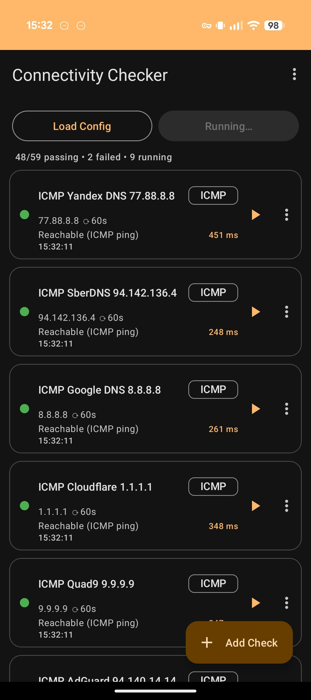
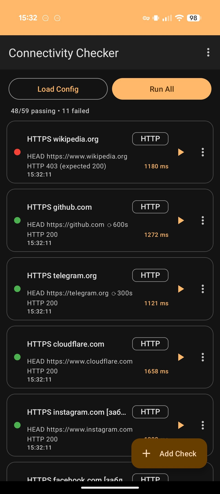
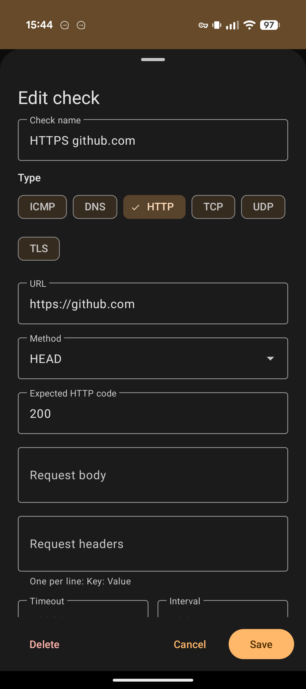
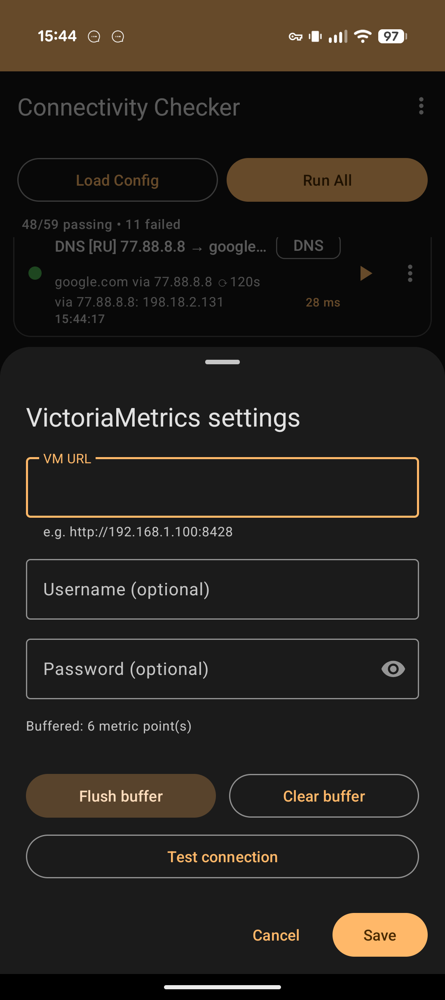

# Connectivity Checker

Android-приложение для проверки сетевой связности с телефона: ICMP, DNS, HTTP, TCP, UDP и TLS-проверки
описываются в YAML, запускаются вручную или по расписанию, а результаты можно писать метриками
в VictoriaMetrics.

Практический смысл — посмотреть на сеть глазами клиента: из конкретного Wi-Fi, из мобильного оператора,
из-за VPN. То, что видно с сервера, и то, что видит телефон, часто расходится.

| Прогон набора проверок | Результаты HTTP-проверок |
|---|---|
|  |  |

Слева — `Run All` в процессе: сводка `48/59 passing • 2 failed • 9 running`, у каждой проверки
статус-индикатор, латентность и время последнего запуска; значок ⟳ показывает интервал автозапуска.
Справа — HTTP-проверки после прогона: `wikipedia.org` красный, потому что вернул 403 вместо
ожидаемых 200.

---

## Возможности

- **Шесть типов проверок** — `icmp`, `dns`, `http`, `tcp`, `udp`, `tls`
- **Конфиг в YAML** — импорт из файла, экспорт обратно, встроенный образец с копированием в буфер
- **Редактор в приложении** — добавление и правка проверок без YAML, через bottom sheet
- **Периодический запуск** — поле `interval` у проверки (пока приложение живо, см. [Ограничения](#ограничения))
- **Экспорт в VictoriaMetrics** — Prometheus-формат, Basic Auth, локальный буфер при недоступности сервера
- **Material You** — динамические цвета на Android 12+

Минимальная версия — Android 8.0 (API 26), целевая — Android 14 (API 34).

---

## Сборка

```bash
git clone https://github.com/nd4y/connectivity-checker.git
```

```bash
cd connectivity-checker && ./gradlew assembleDebug
```

APK окажется в `app/build/outputs/apk/debug/app-debug.apk`.

Нужен JDK 17 и Android SDK 34 (build-tools 34.0.0). Gradle подтянется wrapper'ом (8.6).

Готовый debug-APK также собирает GitHub Actions на каждый push в `main` — качается из артефактов
workflow `Android CI`.

### Self-hosted runner

В `runner/` лежит Dockerfile с Ubuntu 22.04, JDK 17, Android SDK и GitHub Actions runner — на случай,
если сборку нужно унести на свою машину. Запуск:

```bash
docker build -t cc-runner ./runner && docker run -d --name cc-runner -e GITHUB_REPO=https://github.com/nd4y/connectivity-checker -e RUNNER_TOKEN=<registration-token> cc-runner
```

`RUNNER_TOKEN` берётся в Settings → Actions → Runners → New self-hosted runner; он одноразовый и живёт
около часа. Дополнительно: `RUNNER_NAME` (по умолчанию `docker-runner`), `RUNNER_LABELS` (по умолчанию
`self-hosted,Linux,android`). Контейнер при остановке сам разрегистрирует runner.

Сам workflow сейчас собирается на `ubuntu-latest` — чтобы переключить на свой runner, поменяйте
`runs-on` в [.github/workflows/android.yml](.github/workflows/android.yml).

---

## Формат конфига

Файл — обычный YAML с единственным ключом верхнего уровня `checks`:

```yaml
checks:
  - name: "Ping Google DNS"
    type: icmp
    host: 8.8.8.8
    timeout: 3000
    interval: 60
```

Полный образец со всеми типами — [app/src/main/assets/sample_config.yaml](app/src/main/assets/sample_config.yaml);
он же доступен в приложении через меню → **Sample Config**.

Загрузка: кнопка **Load Config** (picker принимает любой файл, важно только содержимое).
Выгрузка текущего набора: меню → **Export YAML**. Набор проверок автосохраняется в настройках
приложения и восстанавливается при следующем запуске.

### Редактор без YAML



Тап по ⋮ → **Edit** (или ＋ для новой проверки) открывает ту же модель в виде формы: тип выбирается
чипами, набор полей меняется под выбранный тип — для `http` это URL, метод, ожидаемый код, тело и
заголовки, для `dns` — сервер резолвера, для `tls` — SNI. Заголовки вводятся по одному в строке в
формате `Key: Value`. Изменения сразу попадают в автосохранённый набор и в **Export YAML**.

### Общие поля

| Поле | Тип | По умолчанию | Описание |
|---|---|---|---|
| `name` | string | `Unnamed` | Название в списке и в лейбле метрики |
| `type` | string | **обязательно** | `icmp` \| `dns` \| `http` \| `tcp` \| `udp` \| `tls` (регистр не важен) |
| `timeout` | int | `5000` | Таймаут в миллисекундах |
| `interval` | int | `0` | Период автозапуска в секундах; `0` — только вручную |

### Поля по типам

| Поле | Типы | Описание |
|---|---|---|
| `host` | icmp, dns, tcp, udp, tls | Хост или IP |
| `port` | tcp, udp, tls | Порт; для `tls` по умолчанию `443`, для `tcp`/`udp` обязателен |
| `url` | http | Полный URL со схемой |
| `method` | http | `GET`, `HEAD`, `POST`; всё остальное трактуется как `GET` |
| `expected_code` | http | Ожидаемый HTTP-код; при несовпадении проверка красная |
| `body` | http | Тело для `POST` |
| `headers` | http | Map заголовков; `Content-Type` из неё же задаёт тип тела `POST` |
| `dns_server` | dns | IP резолвера; без него используется системный DNS |
| `sni` | tls | SNI в ClientHello; по умолчанию равен `host` |

Неизвестное значение `type` и отсутствие `type` — ошибка парсинга, приложение покажет её в snackbar
и оставит прежний набор проверок.

### Что именно делает каждая проверка

**`icmp`** — запускает `/system/bin/ping -c 1`. Если бинарника нет или он вернул ошибку, откатывается
на `InetAddress.isReachable()`, которая на Android обычно означает TCP-пробу порта 7, а не ICMP.
В сообщении результата видно, какой путь сработал.

**`dns`** — без `dns_server` дёргает `InetAddress.getAllByName()` (системный резолвер, с кэшем ОС).
С `dns_server` собирает DNS-запрос вручную и шлёт UDP на порт 53 указанного сервера. Собственный
резолвер запрашивает только записи **A**, читает не более 512 байт ответа и разбирает лишь A-записи;
CNAME-цепочки и AAAA он покажет как «Resolved (no A records)».

**`http`** — OkHttp с включёнными редиректами (в том числе http→https). Таймаут применяется к connect,
read и write по отдельности. Успех — любой полученный ответ, если `expected_code` не задан.

**`tcp`** — обычный `connect()` на `host:port`, меряется время до установления соединения.

**`udp`** — шлёт один байт `0x00` и ждёт ответа. Обратите внимание: **UDP-проверка неоднозначна по
природе**. Таймаут помечается как failure, хотя молчание — нормальное поведение большинства UDP-служб;
достоверный отрицательный результат даёт только ICMP port unreachable. Практически полезно для
DNS (53) и подобных сервисов, отвечающих на любой мусор.

**`tls`** — TCP-connect, затем handshake с явным SNI. В сообщении: валидность имени хоста, CN
сертификата, сколько дней до истечения и предупреждение при остатке меньше 30 дней. Просроченный
сертификат — failure. Комбинация `host: <IP>` + `sni: <имя>` позволяет проверить конкретный
бэкенд в обход DNS.

---

## Экспорт метрик в VictoriaMetrics



Меню → **VictoriaMetrics**. Задаются URL (например `https://vm.example.com`), опционально логин
и пароль для Basic Auth. Кнопка **Test connection** дёргает `/api/v1/query?query=up`.
Экспорт включается самим фактом непустого URL.

После каждой проверки в `<url>/api/v1/import/prometheus` уходит:

```
connectivity_check_up{name="…",type="…",host="…",url="…",port="…"} 1|0 <ms>
connectivity_check_latency_ms{name="…",type="…",host="…",url="…",port="…"} <ms> <ms>
```

Лейблы `host`, `url` и `port` присутствуют только у тех проверок, где соответствующее поле задано.
`connectivity_check_latency_ms` не отправляется, если замер не состоялся.

Если сервер недоступен, точки складываются в локальную базу Room и досылаются пачками по 500 штук:
`MetricsSyncWorker` (WorkManager) пробует каждые 15 минут, плюс есть ручной **Flush buffer** в диалоге
настроек. После успешной досылки записи старше 7 дней вычищаются. Текущий размер буфера показан
там же строкой `Buffered: N metric point(s)`, кнопка **Clear buffer** сбрасывает его целиком.

Примеры запросов:

```promql
min_over_time(connectivity_check_up{name="TLS google.com:443"}[1h])
```

```promql
histogram_quantile(0.95, sum by (le, name) (rate(connectivity_check_latency_ms_bucket[5m])))
```

(второй сработает только если вы агрегируете латентность в гистограмму на стороне VM — «из коробки»
метрика пишется как gauge, для перцентилей проще `quantile_over_time`).

---

## Ограничения

Стоит знать до того, как полагаться на приложение в мониторинге:

- **Периодические проверки живут только пока жив процесс.** `interval` реализован корутинами во
  `viewModelScope`: свернули приложение — Android рано или поздно убьёт процесс, и автозапуск
  прекратится. Фоновой службы нет. В фоне работает только досылка уже накопленных метрик.
- **Пароль от VictoriaMetrics хранится в SharedPreferences открытым текстом.** На неrooted-устройстве
  это недоступно другим приложениям, но шифрования нет — не используйте учётку с широкими правами.
- **Разрешён cleartext HTTP** для всего приложения ([network_security_config.xml](app/src/main/res/xml/network_security_config.xml)),
  иначе не проверить внутренние сервисы без TLS.
- **ICMP на Android не гарантирован** — см. описание `icmp` выше.
- **Индексы проверок и периодические задачи** привязаны к позиции в списке; массовая правка через
  YAML надёжнее, чем много точечных удалений подряд.

---

## Структура проекта

```
app/src/main/java/com/connectivity/checker/
├── checker/     — реализации проверок (NetworkChecker + 6 классов + фабрика)
├── model/       — CheckConfig, CheckResult, перечисления
├── yaml/        — парсер и экспортёр YAML (snakeyaml, SafeConstructor)
├── metrics/     — Room-буфер, отправка в VM, WorkManager
├── settings/    — SharedPreferences-обёртка
├── ui/          — bottom sheet'ы редактора проверки и настроек VM
├── adapter/     — RecyclerView-адаптер списка
└── viewmodel/   — MainViewModel: состояние, запуск, планирование
runner/          — Docker-образ self-hosted GitHub Actions runner
```

Стек: Kotlin, корутины, ViewBinding, Material 3, OkHttp, Room, WorkManager, snakeyaml.
Compose не используется — вёрстка на XML.

---

## Добавить новый тип проверки

1. Добавить значение в `CheckType` ([model/CheckConfig.kt](app/src/main/java/com/connectivity/checker/model/CheckConfig.kt)).
2. Реализовать `NetworkChecker` в `checker/` — вернуть `CheckResult` со статусом, латентностью и
   человекочитаемым сообщением; исключения ловить внутри.
3. Зарегистрировать в `CheckerFactory`.
4. Если появились новые поля конфига — добавить их в `CheckConfig`, `YamlParser` и `YamlExporter`
   (все три, иначе поле потеряется при экспорте), и в форму `EditCheckBottomSheet`.
5. Дописать пример в `sample_config.yaml` и таблицу полей в этом README.
